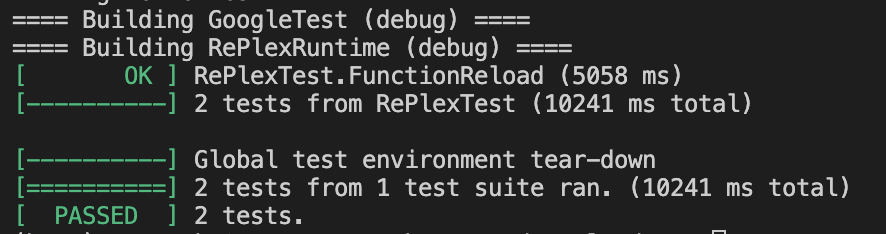

# Code Reloader:
A code reloader, also known as hot reload, hot deployment, or hot swapping, is a development technique that allows developers to make changes to their codebase while the application is running. This means that developers can apply changes to a running program without the need to stop or restart the application, or go through the build package or deploy steps.

## Componenets:
- shared lib: act as a live code-reloader
- runtime

## Symbols
- Symbols: used by linker to determine addr space of a function, var, etc... Symbols are used by linker @ compile time(locates memory address of instruction). 
UNIX APIs fro symbol associations:
- dlopen: Given a file name, reads the library from disk into memory
- dlsym: Given a symbol, returns the address of that symbol
- dlerror: Returns an error message describing the last thing that went wrong
- dlclose: Releases a reference to the specified library. If the reference count drops to zero, the library is removed from the address space.

## Interface Structure
- RePlex will need to expose two public interfaces, one for publishing a hot-loadable library, and one for loading and reloading those hot-loadable libraries. To do this, we’ll make a class called RePlexModule in `Replex.h`. 
- Hot reladable libraries will inherit from this class. Promoting cleaner Implementation
- only two public functions RePlexModule will expose to our runtime is LoadLibrary and ReloadLibrary

## Testing
- test module is `Test.h`
- using google test framework
- emit code as texts using fixture class to enable running tests
- write test cases to test.cpp file
- test if reloading works with expected correct values in 2 different versions of test module

## Output:

## How to run:
- install premake5

In command line:
- run `premake5 gmake`
- run `make`
- run the runtime: `RePlexRuntime`
- reccomend to run `make clean` if any issues

*This program runs or can be used only on Linux/macOS (UNIX based platforms)

## References:
- howistart.org/cpp
- googletest
- UNIX dynamic loading <dlfcn.h>
- C++ docs

